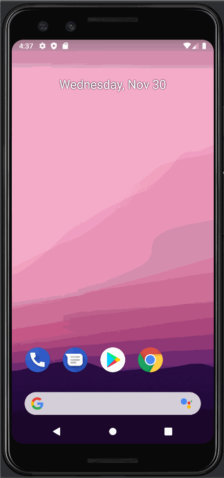

# Project INSO4101 - *Student Agenda*

**Student Agenda** is an android app that allows building task management functionality including adding new items, editing and deleting an existing item.

## User Stories

The following functionalities are completed:

* [x] User can **view a list of todo items**
* [x] User can **successfully add and remove items** from the todo list
* [x] User's **list of items persisted** upon modification and and retrieved properly on app restart

The following **optional** features are implemented:

* [x] User can **tap a todo item in the list and bring up an edit screen for the todo item** and then have any changes to the text reflected in the todo list
* [x] **Upward navigation** is implemented which allows the user to return to the logical parent screen in the app's hierarchy by pressing the "Up" button

The following **improvement** features are implemented:

* [x] User must enter an item before adding or editing something on the list which fixes the problem of having empty spaces to the list

## UI/UX prototype
* The following prototype has some workflow functionalities such as:
* [x] From “home” screen to “make task” screen
* [x] From “make task” screen to either “add notification”, “add due date”, “add course” or “add description”
* [x] From any screen to “home screen” (by pressing “done” or “discard”
* Prototype created with [Figma] (https://www.figma.com/proto/fgCclYA2CqF5VfGFj26OxL/Student-Agenda-App?page-id=0%3A1&node-id=101%3A589&viewport=1215%2C2525%2C0.49&scaling=scale-down&starting-point-node-id=101%3A245)

## Video Walkthrough

Here's a walkthrough of implemented user stories:

GIF created with [LiceCap](http://www.cockos.com/licecap/).
